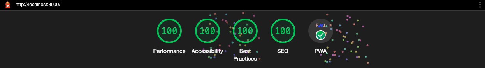

# Static HTML Layout Playground



This project sets up an ExpressJS server that serves a static `.html` file as a website to the browser. When starting the project, it launches an incognito Google Chrome window. While the HTML is a simple `.html` file, the `css/style.css` file is generated based on the SCSS files in the `scss/` directory. It also minifies the very little vanilla JavaScript it implements with UglifyJS.

This project is intended as a simple playground to build out website/page layouts.

## Usage Instructions

Before you begin, if you haven't already done so you'll need to install the dependencies.

```sh
yarn
```

Start the project to open the site locally in your browser.

```sh
yarn start
```

> When the project starts, if no Google Chrome process is running on your computer, it will open `localhost:3000` in an incognito window of Google Chrome.

The console output after running `yarn start` will print the output from both the express app and the SCSS compiler.

## HTML Validator

Validate the `index.html` file's markup with `html-validate`.

```sh
npx html-validate index.html
```

## Lighthouse

This project includes a Node script to run Lighthouse reports. If the report fails, it will open the report results in your browser.

```sh
./lighthouse.js http://localhost:3000
```

To open the report in your browser even if the tests all pass, add the `--view` argument.

```sh
./lighthouse.js http://localhost:3000 --view
```

## Resources

To check the contracts of your colors for AA or AAA compliance, use the WebAIM Contrast Checker:

- <https://webaim.org/resources/contrastchecker/>
